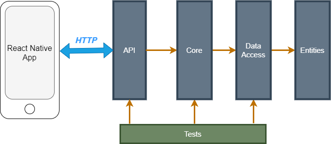
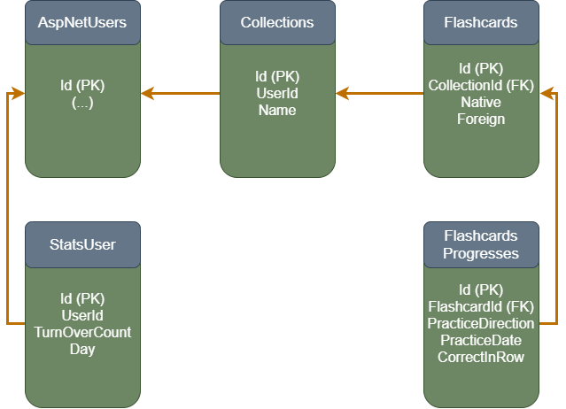

# MobileService

## About app

Mobile Service is data processor for `reat native` app [GoFlashcards](https://expo.io/@gxoyazt/projects/GoFlashcards).
You can find code for front-end [here](https://github.com/GxOyAzT/MobileServiceFront).

## Architecture

Application is designed on `onion architecture`.

### Api
`ASP.NET Core 3.1` app handles requests. This project has direct reference to `Core` project and indirect to `DataAccess` and `Entities`.
* User registration
* User login
* Generate `JWT token`
* Authenticate user
* Handle CRUD  for entities
* Handle other http requests

Used packages:
* AutoMapper.Extensions.Microsoft.DependencyInjection (8.1.1)
* MediatR.Extensions.Microsoft.DependencyInjection (9.0.0)
* Microsoft.AspNetCore.Authentication.JwtBearer (3.1.14)
* Microsoft.EntityFrameworkCore.Design (5.0.5)
* Microsoft.EntityFrameworkCore.Tools (5.0.5)
* Swashbuckle.AspNetCore (5.6.3)

### Core
`Class Library .Net Core 3.1` contains implemetation for buisness logic. It is created with `mediator design pattern` using `MediaR 9.0.0`. This project has direct reference to `DataAccess` project and indirect to `Entities`.
* Contains implementation for CRUD operations on base entities (collection, flashcard) and validation.
* Contains implemantation for buisness logic
  * Handle updating flashcard learning progress
  * Handle requesting user statistics for charts and tables

Used packages:
* MediaR (9.0.0)

### DataAccess
`Class Library .Net Core 3.1` data connection layer. It is created with `repository design pattern`. This project has direct reference to `Entities`.
It contains `generic` interface and it's implementation for CRUD operations on each entity which reflects table in database (`ORM`). This implemantation layer is inherited in each repository so that each repo can be extended with necessary methods.

Used packages:
* Microsoft.AspNetCore.Identity.EntityFrameworkCore (5.0.5)
* Microsoft.EntityFrameworkCore.SqlServer (5.0.5)

### Entities 
`Class Library .Net Core 3.1` contains ORM models, enums and `data transfer objects`.

Used packages:
* AutoMapper (10.1.1)

### Tests
`xUnit .NET Core 3.1` contains `unit tests`, `integration tests` and `end-to-end tests`. This project contains several MockDataVx classes which seeds data in tests database each time test (method) is executed.
* DataAccess is tested using unit tests approach. There is only need to test repos so the repo class is only implemantation that is tested.
* Core is tested using 
  * unit tests approach: testing work units which do not use any other implemantations (do not have injected implemantations) e.g. [CalculatePracticeDateH](./MobileService.Core/WorkUnits)
  * integratioin tests approach: testing units that has inject other units. Mostly repos from DataAccess layer.
* Api is tested using end-to-end approach. Each method that handle web request has its own test.

### TestsSpeed
`Console Application .NET Core 3.1` is used for creating performance tests.
[Example](https://github.com/GxOyAzT/MobileService/tree/master/MobileService.TestsSpeed/GetFlashcardsListWithProgressTests) of test conclusive using parallel approach over synchronous.

## Database

Tables:
* AspNetUsers is base table given by Identity.
* Collections table reflects folders (collections of flashcards)
* Flashcard table reflects one word user want to learn
* FlaschardProgresses table reflects both sides of one flashcard (word) so that laerning process can be from native to foreign and from foreign to native
* StatsUser table contain information of how much flashcards user turn over each day

Engine: `SQL Server`. Database was created using EntityFrameworkCore migrations (`code-first approach`).